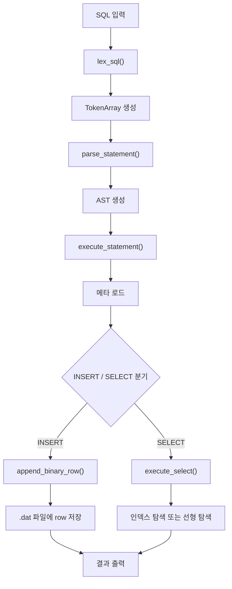
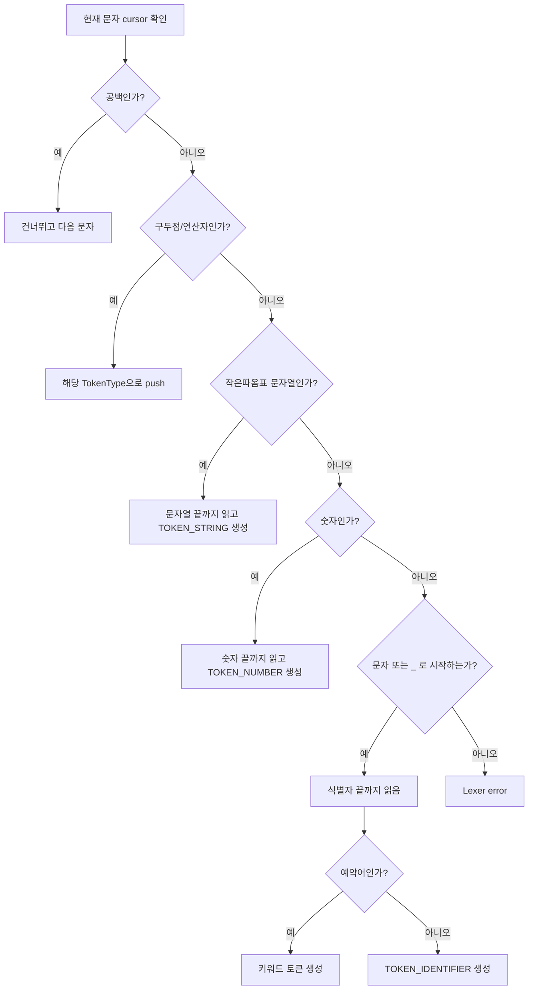
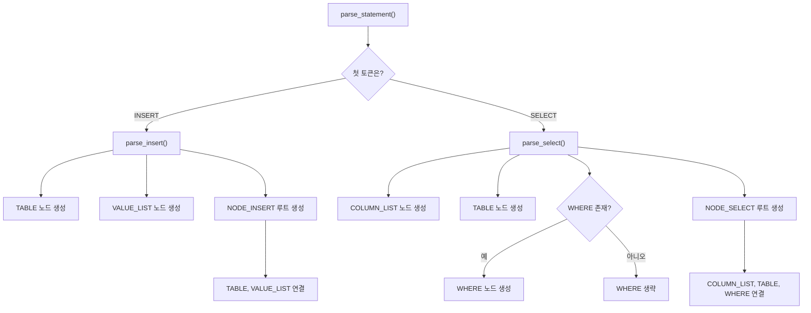
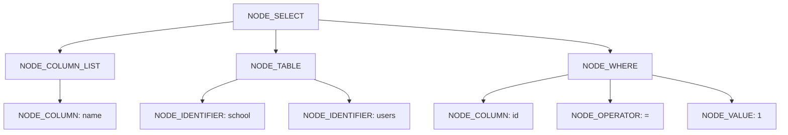
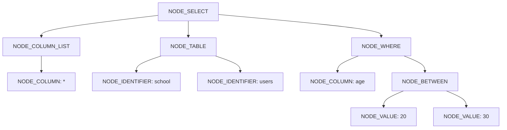
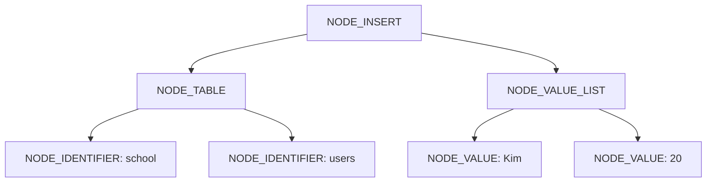
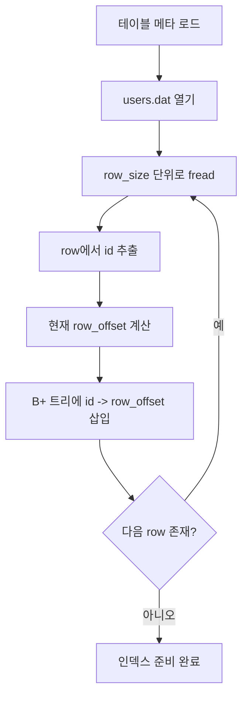
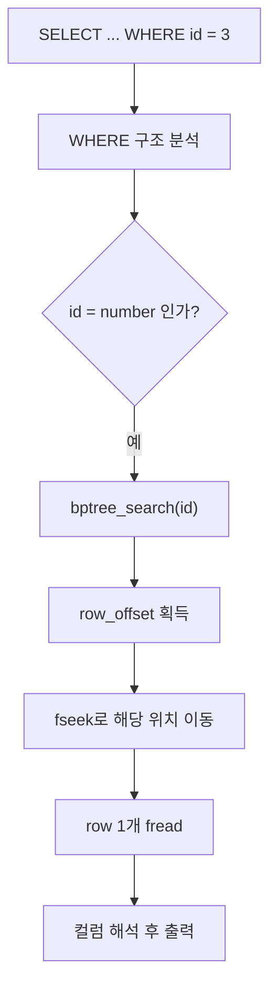
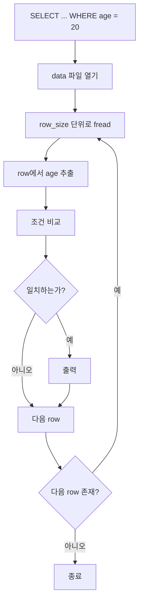

# SQLInsertSelect

파일 기반 미니 SQL 처리기입니다.  
기존의 `lexer -> parser -> AST -> executor -> binary storage` 구조를 유지하면서, 최근 버전에서는 아래 기능을 지원합니다.

- `id` 자동 증가
- 메모리 기반 B+ 트리 인덱스
- `WHERE id = ?` 인덱스 탐색
- 그 외 조건의 선형 탐색
- `BETWEEN` 지원
- 대량 데이터 생성기
- 쿼리 실행 시간 로그

## 1. 프로젝트 핵심 개념

이 프로젝트는 실제 DBMS처럼 SQL 문자열을 바로 실행하지 않습니다.  
대신 아래 순서로 처리합니다.

```text
SQL 문자열
-> 토큰(Token)
-> AST(Abstract Syntax Tree)
-> 실행기(Executor)
-> 메타/데이터 파일 접근
-> 결과 출력
```

실제 저장소는 두 부분으로 나뉩니다.

- 메타 파일: `meta/<schema>/<table>.schema.csv`
- 데이터 파일: `data/<schema>/<table>.dat`

예를 들어 `school.users` 테이블은 아래 두 파일을 사용합니다.

- `meta/school/users.schema.csv`
- `data/school/users.dat`

## 2. 저장 구조

### 2.1 메타 파일

예시:

```csv
column_name,type,size
id,INT,4
name,CHAR,20
age,INT,4
```

의미:

- `id`: 4바이트 정수
- `name`: 20바이트 고정 길이 문자열
- `age`: 4바이트 정수

### 2.2 바이너리 데이터 파일

`users` 한 row는 아래 순서로 저장됩니다.

```text
[id 4바이트][name 20바이트][age 4바이트]
```

즉 row 하나의 크기는 `28`바이트입니다.

## 3. 전체 실행 흐름

아래는 SQL 한 줄이 실제로 실행되는 전체 흐름입니다.



관련 파일:

- `src/main.c`
- `src/lexer.c`
- `src/parser.c`
- `src/executor.c`
- `src/storage.c`

## 4. 토큰화는 어떻게 하는가

토큰화는 `src/lexer.c`의 `lex_sql()`가 담당합니다.  
이 함수는 SQL 문자열을 왼쪽부터 한 글자씩 읽으면서 의미 단위로 잘라 `TokenArray`에 넣습니다.

### 4.1 토큰 종류

대표 토큰은 아래와 같습니다.

- `TOKEN_IDENTIFIER`
- `TOKEN_STRING`
- `TOKEN_NUMBER`
- `TOKEN_STAR`
- `TOKEN_COMMA`
- `TOKEN_DOT`
- `TOKEN_LPAREN`
- `TOKEN_RPAREN`
- `TOKEN_EQUAL`
- `TOKEN_NOT_EQUAL`
- `TOKEN_GREATER`
- `TOKEN_GREATER_EQUAL`
- `TOKEN_LESS`
- `TOKEN_LESS_EQUAL`
- `TOKEN_KEYWORD_SELECT`
- `TOKEN_KEYWORD_INSERT`
- `TOKEN_KEYWORD_WHERE`
- `TOKEN_KEYWORD_BETWEEN`
- `TOKEN_KEYWORD_AND`

중요한 점은:

- `school`, `users`, `age`, `name`는 전부 lexer 단계에서는 `TOKEN_IDENTIFIER`
- `SELECT`, `INSERT`, `WHERE`, `BETWEEN`, `AND`는 키워드 토큰
- 실제로 schema인지 table인지 column인지는 parser가 문맥으로 판단

### 4.2 토큰화 flowchart



### 4.3 예시

입력:

```sql
SELECT name FROM users WHERE age BETWEEN 20 AND 30;
```

토큰 결과:

```text
TOKEN_KEYWORD_SELECT   "SELECT"
TOKEN_IDENTIFIER       "name"
TOKEN_KEYWORD_FROM     "FROM"
TOKEN_IDENTIFIER       "users"
TOKEN_KEYWORD_WHERE    "WHERE"
TOKEN_IDENTIFIER       "age"
TOKEN_KEYWORD_BETWEEN  "BETWEEN"
TOKEN_NUMBER           "20"
TOKEN_KEYWORD_AND      "AND"
TOKEN_NUMBER           "30"
TOKEN_SEMICOLON        ";"
TOKEN_EOF              ""
```

## 5. AST를 어떻게 쓰는가

이 프로젝트는 파싱 결과를 단순 구조체가 아니라 **노드 기반 AST**로 표현합니다.

기본 노드 구조는 아래와 같습니다.

```c
typedef struct ASTNode {
    NodeType type;
    ASTValueType value_type;
    char *text;
    struct ASTNode *first_child;
    struct ASTNode *next_sibling;
} ASTNode;
```

핵심 필드:

- `type`: 이 노드가 무엇인지
- `text`: 컬럼명, 테이블명, literal 값, 연산자 문자열
- `first_child`: 첫 번째 자식
- `next_sibling`: 같은 부모를 가진 다음 형제

즉 이 프로젝트는 `left/right` 이진트리보다는  
`first_child + next_sibling` 방식의 일반 트리 구조를 사용합니다.

## 6. AST는 어떻게 만들어지는가

`src/parser.c`의 `parse_statement()`가 시작점입니다.

- 첫 토큰이 `INSERT`면 `parse_insert()`
- 첫 토큰이 `SELECT`면 `parse_select()`

그 안에서 다시:

- `parse_table_node()`
- `parse_column_list_node()`
- `parse_where_node()`
- `parse_value_list_node()`

같은 함수들이 자식 노드를 만들어 연결합니다.

### 6.1 AST 생성 flowchart



## 7. SELECT AST 예시

예시 SQL:

```sql
SELECT name FROM users WHERE id = 1;
```

AST:

```text
NODE_SELECT
├── NODE_COLUMN_LIST
│   └── NODE_COLUMN("name")
├── NODE_TABLE
│   ├── NODE_IDENTIFIER("school")
│   └── NODE_IDENTIFIER("users")
└── NODE_WHERE
    ├── NODE_COLUMN("id")
    ├── NODE_OPERATOR("=")
    └── NODE_VALUE("1")
```

flowchart로 보면:



## 8. BETWEEN AST 예시

예시 SQL:

```sql
SELECT * FROM users WHERE age BETWEEN 20 AND 30;
```

AST:

```text
NODE_SELECT
├── NODE_COLUMN_LIST
│   └── NODE_COLUMN("*")
├── NODE_TABLE
│   ├── NODE_IDENTIFIER("school")
│   └── NODE_IDENTIFIER("users")
└── NODE_WHERE
    ├── NODE_COLUMN("age")
    └── NODE_BETWEEN
        ├── NODE_VALUE("20")
        └── NODE_VALUE("30")
```

flowchart:



## 9. INSERT AST 예시

예시 SQL:

```sql
INSERT INTO users VALUES ('Kim', 20);
```

현재 버전에서는 `id`는 직접 넣지 않습니다.  
`name`, `age`만 입력하고 `id`는 자동 증가합니다.

AST:

```text
NODE_INSERT
├── NODE_TABLE
│   ├── NODE_IDENTIFIER("school")
│   └── NODE_IDENTIFIER("users")
└── NODE_VALUE_LIST
    ├── NODE_VALUE("Kim")
    └── NODE_VALUE("20")
```

flowchart:



## 10. AST를 실제 실행에 어떻게 쓰는가

AST는 단순 그림이 아니라, 실행기의 직접 입력입니다.

예를 들어 `execute_statement()`는:

1. AST에서 `NODE_TABLE`을 찾음
2. schema/table 이름 추출
3. 메타 파일 로드
4. 루트가 `NODE_INSERT`인지 `NODE_SELECT`인지 보고 분기

즉 문자열을 다시 읽는 게 아니라,  
이미 만들어진 AST를 따라가며 실행합니다.

## 11. B+ 트리는 어떻게 쓰이는가

이 프로젝트의 B+ 트리는 `src/bptree.c`에 있고,  
현재는 `id` 단일 컬럼 전용입니다.

- key: `id`
- value: `row_offset`

중요한 점은:

- 실제 row 전체는 메모리에 올리지 않음
- 메타 정보와 `id -> row_offset` 인덱스만 메모리에 유지
- 실제 데이터는 계속 `.dat` 파일에서 읽음

## 12. B+ 트리를 메모리에 올리는 과정

테이블 컨텍스트를 처음 준비할 때:

1. `.dat` 파일을 처음부터 끝까지 읽음
2. 각 row의 `id` 추출
3. 해당 row가 파일의 몇 번째 바이트에 있는지 계산
4. B+ 트리에 `id -> row_offset` 삽입

flowchart:



관련 함수:

- `build_id_index_from_data()`
- `bptree_insert()`

## 13. B+ 트리 검색은 어떻게 동작하는가

예시:

```sql
SELECT * FROM users WHERE id = 3;
```

실행 흐름:

1. `WHERE`가 `id = 숫자` 형태인지 확인
2. 맞으면 B+ 트리 사용
3. `bptree_search()`로 `id=3` 검색
4. `row_offset` 획득
5. `.dat` 파일에서 해당 위치로 바로 이동
6. row 하나만 읽어서 출력

flowchart:



관련 함수:

- `extract_index_search_id()`
- `select_by_id_index()`
- `bptree_search()`

## 14. 선형 탐색은 어떻게 동작하는가

예시:

```sql
SELECT * FROM users WHERE age = 20;
SELECT * FROM users WHERE age BETWEEN 20 AND 30;
```

이 경우는 인덱스를 쓰지 않습니다.

흐름:

1. `.dat` 파일을 처음부터 끝까지 읽음
2. 각 row에서 `age` 위치를 메타로 찾음
3. 조건과 비교
4. 맞는 row만 출력

flowchart:



관련 함수:

- `execute_select()`
- `row_matches_where()`

## 15. 인덱스를 쓰는 쿼리와 쓰지 않는 쿼리

인덱스 사용:

```sql
SELECT * FROM users WHERE id = 3;
```

선형 탐색:

```sql
SELECT * FROM users WHERE age = 20;
SELECT * FROM users WHERE name = 'Kim';
SELECT * FROM users WHERE id >= 3;
SELECT * FROM users WHERE age BETWEEN 20 AND 30;
```

즉 현재 규칙은 아주 명확합니다.

- `WHERE id = 숫자`만 B+ 트리
- 그 외는 모두 선형 탐색

## 16. 지원 SQL

### INSERT

```sql
INSERT INTO users VALUES ('Kim', 20);
INSERT INTO school.users VALUES ('Lee', 25);
```

### SELECT

```sql
SELECT * FROM users;
SELECT name FROM users WHERE id = 1;
SELECT * FROM users WHERE age = 20;
SELECT * FROM users WHERE age >= 18;
SELECT * FROM users WHERE age BETWEEN 20 AND 30;
```

### 현재 지원하는 비교

- `=`
- `!=`
- `>`
- `>=`
- `<`
- `<=`
- `BETWEEN low AND high`

### 현재 지원하지 않는 것

- `AND`
- `OR`
- 다중 WHERE 조건
- 괄호식
- JOIN
- UPDATE
- DELETE
- ORDER BY
- GROUP BY

## 17. 빌드

### Windows (GCC)

```powershell
gcc -std=c11 -Wall -Wextra -pedantic -Isrc -o sql_processor_bptree src\main.c src\lexer.c src\parser.c src\meta.c src\storage.c src\executor.c src\util.c src\bptree.c
```

### Docker

```powershell
docker build -t sql-insert-select .
docker run --rm -it -v "${PWD}:/workspace" sql-insert-select
```

### REPL 실행

```powershell
.\sql_processor_bptree.exe --repl
```

### 샘플 SQL 실행

```powershell
.\sql_processor_bptree.exe sample_select.sql
.\sql_processor_bptree.exe sample_insert.sql
.\sql_processor_bptree.exe sample_where_between.sql
```

## 18. 대량 데이터 생성기

`tools/generate_records.py`

예시:

```powershell
python tools\generate_records.py --count 1000000 --output generated_records.sql --seed 20260415
```

생성 SQL 형식:

```sql
INSERT INTO users VALUES ('Alice', 27);
```

## 19. 성능 측정

PowerShell:

```powershell
Set-Content q_id.sql "SELECT * FROM users WHERE id = 500000;"
Set-Content q_age.sql "SELECT * FROM users WHERE age = 30;"
Set-Content q_between.sql "SELECT * FROM users WHERE age BETWEEN 20 AND 30;"

Measure-Command { .\sql_processor_bptree.exe q_id.sql *> $null }
Measure-Command { .\sql_processor_bptree.exe q_age.sql *> $null }
Measure-Command { .\sql_processor_bptree.exe q_between.sql *> $null }
```

의미:

- `id = ?`는 B+ 트리
- `age = ?`, `BETWEEN`은 선형 탐색

## 20. 테스트

단위 테스트:

```powershell
gcc -std=c11 -Wall -Wextra -pedantic -Isrc -o tests\bptree_tests.exe tests\bptree_tests.c src\lexer.c src\parser.c src\util.c src\bptree.c
.\tests\bptree_tests.exe
```

현재 테스트는 최소한 아래를 확인합니다.

- B+ 트리 삽입/검색
- `BETWEEN` 파싱 AST 구조

## 21. 제한 사항

- B+ 트리는 `id` 전용
- 인덱스는 메모리에만 유지
- 프로그램 시작 또는 테이블 preload 시 `.dat`를 읽어 인덱스 재구축
- `BETWEEN`은 INT 컬럼만 허용
- `AND`, `OR`, 다중 조건 미지원

## 22. 관련 문서

- `AGENT.md`
- `sudo/pseudocode.md`
- `check.md`
- `context.md`

## 23. 한 줄 요약

이 프로젝트는 SQL을 토큰화하고 AST로 바꾼 뒤, `WHERE id = ?`는 메모리 B+ 트리로 빠르게 찾고, 나머지 조건은 바이너리 파일을 선형 탐색하는 파일 기반 미니 DBMS입니다.
